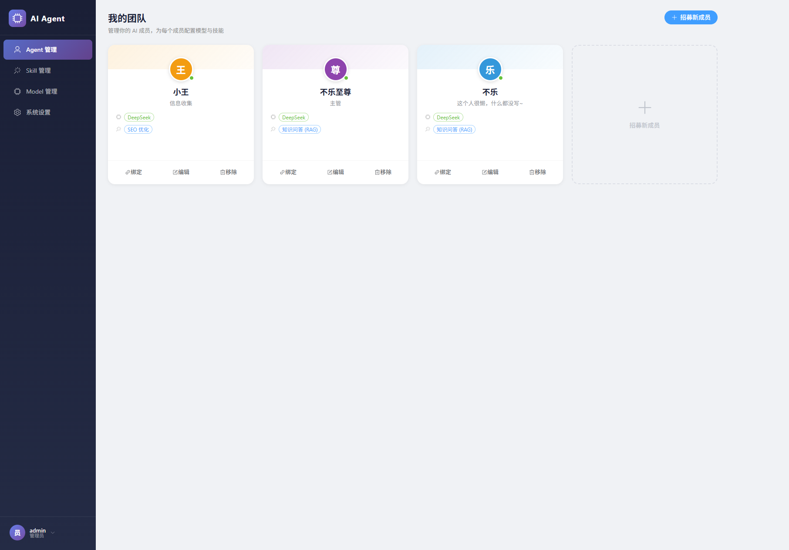
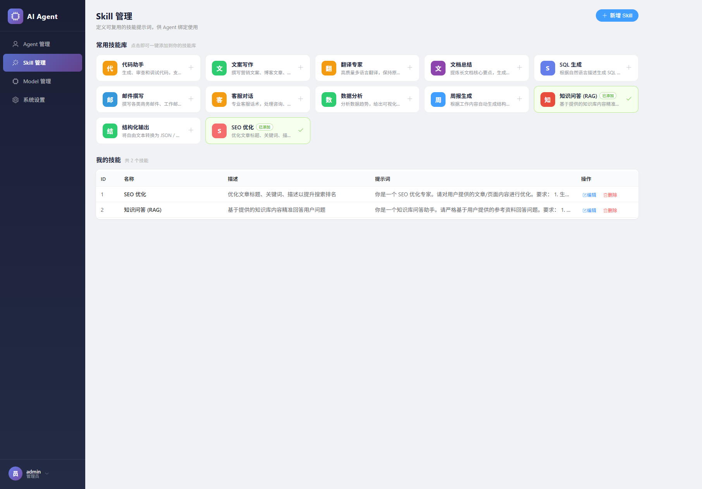
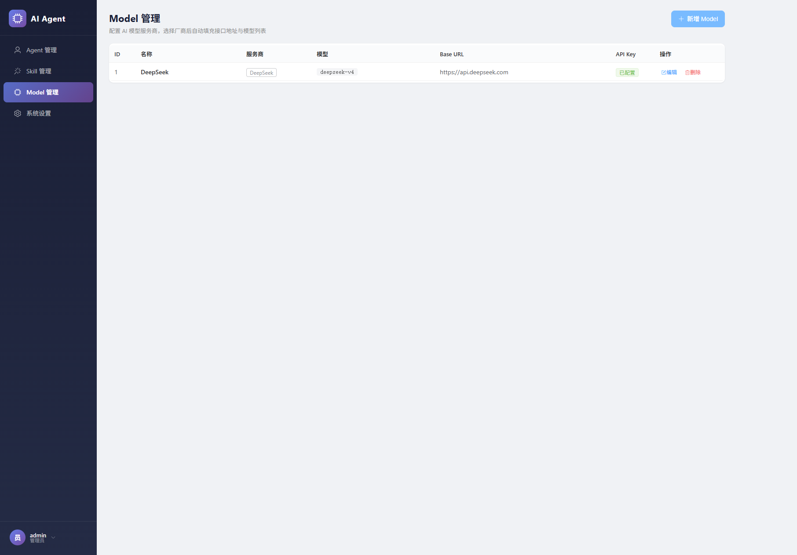
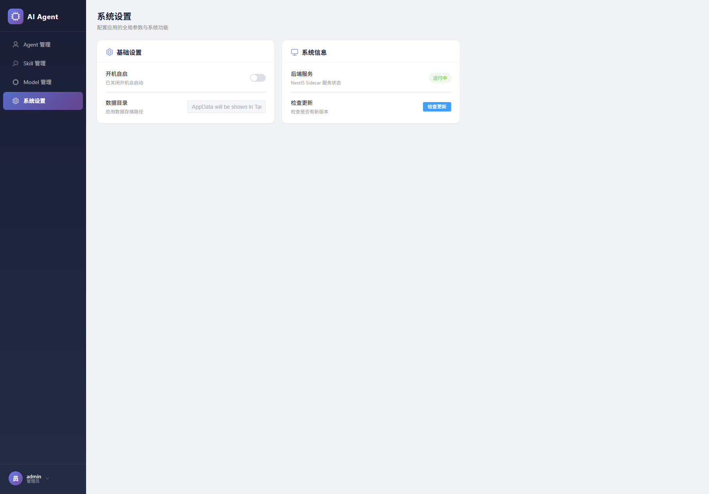

# 星曜 Agent Platform / AI 智能体管理平台

<div align="center">

A desktop AI agent management platform built with `Tauri 2 + Vue 3 + NestJS + Prisma + SQLite`.

基于 `Tauri 2 + Vue 3 + NestJS + Prisma + SQLite` 的桌面端 AI 智能体管理平台。

[](LICENSE)
[](https://tauri.app)
[](https://vuejs.org)
[](https://nestjs.com)

</div>

---

## Overview / 项目概览

Xingyao Agent Platform is a desktop tool for managing AI agents, skills, and models in one place. It is designed for users who want a local, structured, and extensible workspace for building agent workflows.

星曜 Agent Platform 是一个把 Agent、Skill、Model 和认证能力统一起来的桌面端管理工具，适合用于本地化、结构化、可扩展的 AI 工作流编排。

Key ideas / 核心理念:

- Turn each agent into a “team member” with its own model and skill set
- Make skills reusable and searchable, so they stay manageable even when the library grows to thousands
- Keep the desktop app lightweight while the backend runs as a Tauri Sidecar

- 将每个 Agent 视作“团队成员”，为它绑定独立模型和技能
- 让技能可复用、可搜索、可分页，即使技能库增长到几千条也能稳定管理
- 用 Tauri Sidecar 承载后端服务，保持桌面应用轻量化

---

## Features / 功能亮点

- Agent management / Agent 管理
  - Card-based layout for browsing and editing agents
  - Bind a model and multiple skills for each agent

- Skill library / 技能库
  - Supports `prompt`, `tool`, and `mixed` skill types
  - Paginated search, filtering, and sorting for large libraries
  - Preset skills can be imported with one click

- Model management / 模型管理
  - Built-in provider presets for fast setup
  - Custom model configuration with provider, base URL, and API key

- Auth and profile / 认证与个人信息
  - JWT login on the backend
  - Default admin account is initialized automatically on first run

- Desktop experience / 桌面体验
  - System tray
  - Single instance
  - Close-to-tray behavior
  - Backend starts automatically through Tauri Sidecar

---

## Screenshots / 界面预览

### Login / 登录页

[](screenshots/login.png)

Smooth gradient background and floating animation.

渐变背景加轻量动效的登录页。

### Agents / Agent 管理

[](screenshots/agents.png)

Card-style agent management with model and skill binding.

卡片式 Agent 管理，支持模型和技能绑定。

### Skills / 技能库

[](screenshots/skills.png)

Optimized for large skill libraries with search, filters, and pagination.

面向大规模技能库的优化界面，支持搜索、筛选和分页。

### Models / 模型管理

[](screenshots/models.png)

Provider presets plus custom model setup.

支持厂商预设和自定义模型配置。

### Settings / 系统设置

[](screenshots/settings.png)

System and runtime controls.

系统与运行状态相关设置。

---

## Tech Stack / 技术栈

| Layer / 层级 | Stack / 技术 |
|------|------|
| Frontend / 前端 | Vue 3, Vite 6, Element Plus, Pinia, TypeScript |
| Backend / 后端 | NestJS 10, Prisma 6, SQLite |
| Desktop / 桌面端 | Tauri 2, Rust |

---

## Quick Start / 快速开始

### Requirements / 环境要求

- Node.js 18+
- Rust stable
- Visual Studio Build Tools on Windows

### Install / 安装依赖

```bash
npm install
cd frontend && npm install
cd nestjs && npm install && npm run prisma:generate
```

### Development / 开发模式

Run backend and frontend separately:

分别启动后端和前端：

```bash
cd nestjs && npm run start:dev
cd frontend && npm run dev
```

Run the full desktop app with Tauri:

使用 Tauri 启动完整桌面应用：

```bash
cd nestjs && npm run build
npm run tauri dev
```

### Production build / 生产构建

```bash
cd nestjs && npm run build
npm run tauri build
```

The desktop bundle is generated under `src-tauri/target/release/bundle/`.

桌面安装包会输出到 `src-tauri/target/release/bundle/`。

---

## Default Accounts / 默认账号

The backend initializes a default admin account on first launch:

后端会在首次启动时自动初始化默认管理员账号：

- Username / 用户名: `admin`
- Password / 密码: `123456`

---

## Project Structure / 项目结构

```text
D:\AIAgentPlatform\
├─ frontend/                 Frontend app / 前端应用
│  ├─ src/
│  │  ├─ api/                Axios wrapper and API definitions / 接口封装
│  │  ├─ router/             Routing and guards / 路由与守卫
│  │  ├─ stores/             Pinia stores / 状态管理
│  │  └─ views/              Pages / 页面
│  └─ vite.config.ts
├─ nestjs/                   Backend service / 后端服务
│  ├─ src/
│  │  ├─ auth/               Authentication / 认证
│  │  ├─ agent/              Agent module / Agent 模块
│  │  ├─ skill/              Skill module / Skill 模块
│  │  ├─ model/              Model module / Model 模块
│  │  └─ prisma/             Prisma service / Prisma 服务
│  └─ prisma/schema.prisma
├─ src-tauri/                Tauri shell / Tauri 壳
│  ├─ src/
│  │  ├─ lib.rs
│  │  ├─ main.rs
│  │  ├─ sidecar.rs
│  │  └─ tray.rs
│  └─ tauri.conf.json
├─ screenshots/              Screenshots / 截图
├─ PROJECT.md                 Detailed project docs / 详细项目文档
└─ README.md
```

---

## API and Docs / 接口与文档

Detailed technical notes are in [PROJECT.md](./PROJECT.md), including:

详细技术说明请看 [PROJECT.md](./PROJECT.md)，里面包括：

- API routes / API 接口
- Data model / 数据模型
- Tauri sidecar flow / Tauri Sidecar 流程
- Skill pagination details / 技能库分页细节
- Development notes / 开发注意事项

---

## Large Skill Library Support / 大规模技能库支持

The Skill page has already been optimized for large datasets:

Skill 页面已经针对大规模数据做了优化：

- Server-side pagination / 服务端分页
- Keyword search across name, description, and prompt / 按名称、描述、提示词搜索
- Type filtering / 类型筛选
- Sort controls / 排序控制
- Page-size limits to keep requests stable / 限制页大小，避免一次加载过多

This makes the library practical even when the number of skills grows to several thousand.

这让技能库即使增长到几千条，也依然可以稳定管理。

---

## Available Provider Presets / 可用厂商预设

The app includes preset model providers for fast setup, such as:

应用内置了常见厂商预设，便于快速配置，例如：

- DeepSeek
- OpenAI
- Anthropic (Claude)
- Google (Gemini)
- Groq
- xAI (Grok)
- Mistral AI
- OpenRouter

You can also create custom model entries with your own base URL and API key.

你也可以使用自定义模型配置，填写自己的 Base URL 和 API Key。

---

## License / 许可证

[MIT](LICENSE)
